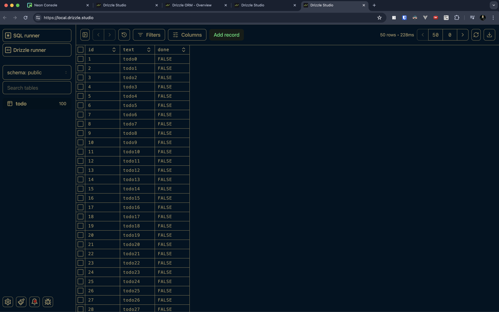
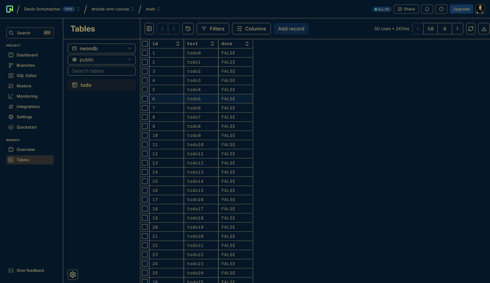

# README

Demo repo for using [drizzle ORM](https://orm.drizzle.team/) and drizzle studio using [neon](https://neon.tech/) with a postgres, serverless db.





## Scripts

- A `scripts/createTodos.ts` file to auto genereate a bunch of db records.

Run typescript scripts without have to compile them to javascript using tsx.

> Note: Must have `"type": "module"` in the `package.json`.

```bash
npx tsx ./scripts/<script>.ts to run a script
```